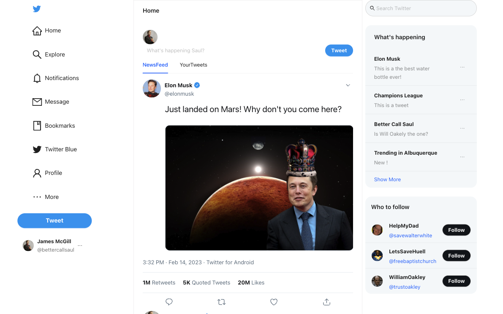

<h1> Twitter Clone</h1>

The common funtionalities are:-

- User can tweet as a fictional character
- All tweets are loaded on top firsrt
- Only the middle section is scrollable

<h2>Click here for live demo </h2>

<h3>About the project </h3>

### Click here for live demo Available Scripts

#### Built With

- React JS
- Ant Design
- Fake Tweet

<h2>Available Scripts</h2>
To run project

### `yarn start`

To build project

### `npm run buil`
